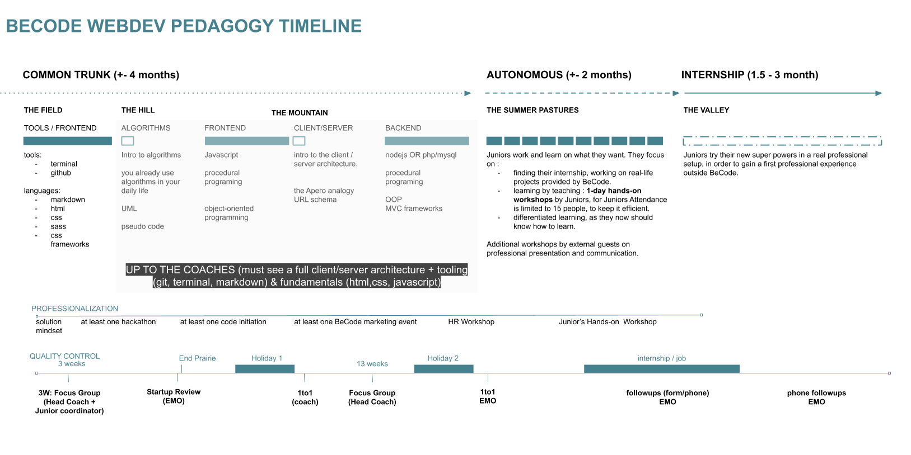

# STARTUP Hopper 1 (25th Wave)

This repo is your go-to place for all information on your activities at BeCode: briefings, tutorials, etc.  
Clone it on your computer and `git pull` regularly in order to fetch the latest updates made by your coaches.

## What's coming

_Attention, this is for information only, we may or may not follow the programme in this order. Remember, you lead your own education 💖_

## How to thrive at BeCode?

Read the following documents:

1. Read the **Pedagogical Contract** in [English](https://github.com/becodeorg/BeCode/blob/master/educationalcontract.md), [French](https://github.com/becodeorg/BeCode/blob/master/contratpedagogique.md), [Dutch](https://github.com/becodeorg/BeCode/blob/master/pedagogischcontract.md)
2. If you need a refresher, [here is the presentation about the rules](https://docs.google.com/presentation/d/1OHA_sYC-1Q_ZU7Fp5G2nNvaf8wfLVcIrC3HqFDs9G58/edit#slide=id.g4ec5c78148_0_56)

Your contacts at BeCode:

1. Your lead coach: Kelian `Kil'` - [kelian.christophe@becode.org](mailto:kelian.christophe@becode.org)
2. Secondary coach: Emily - [emily@becode.org](mailto:emily@becode.org)
3. Your professional insertion referent: Eric - [eric@becode.org](mailto:eric@becode.org)

## Respect for planning: being late & absence

In case of **delay**, **absence** or **early leave** (planned or not), you will need to warn us.

In short here is what you do in any of the three cases above:

1. Send a message to _both_ coaches on Discord or by email
2. Warn BeCode through [my.becode.org](https://my.becode.org/):
   - If you already have some note to justify your absence (eg. a doctor's note), then send this straight to us using the platform (my.becode.org);
   - If you know that you are going to obtain such document, tell us when you notify us of your absence. Once you have the document, send it to us through the platform;
   - When you know that you will have no legal reason for the absence or delay then please let us know <abbr title="As Soon As Possible">ASAP</abbr> as well on Discord. Not showing up or showing up late is considered unprofessional.

**[Reminder](https://github.com/becodeorg/BeCode/blob/master/educationalcontract.md#sanctions)**:

- 2 unjustified occasions of being late or leaving early is seen as an absence
- 2 unjustified absences leads to a one-on-one conversation
- 6 unjustified absences leads to a termination of your contract with us {and the vdab} and results in you leaving this training permanently.
- If the absence rate (justified or not) exceeds 20%, BeCode may decide on the final exclusion of the learner.

## Agenda

To keep up to date with the upcoming events, workshops and hackatons remember to check the **BeCode Global Discord server #events channel**!

## Vacation and holidays

There are 2 vacation blocks of one week:

| Dates                          | What are we doin'?    |
|--------------------------------|-----------------------|
| December 21st -> December 25th | :santa: Holidays      |
| February 15th -> February 19th | :clown_face: Holidays |

Additional holidays:

| Date      | What           |
|-----------|----------------|
| Wed 11/11 | Armistice Day  |
| Fri 25/12 | Christmas Day  |
| Fri 01/01 | New Year's Day |
| Mon 05/04 | Easter Monday  |
| Thu 13/05 | Ascension Day  |
| Mon 24/05 | Whit Monday    |
