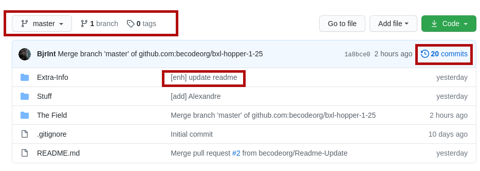
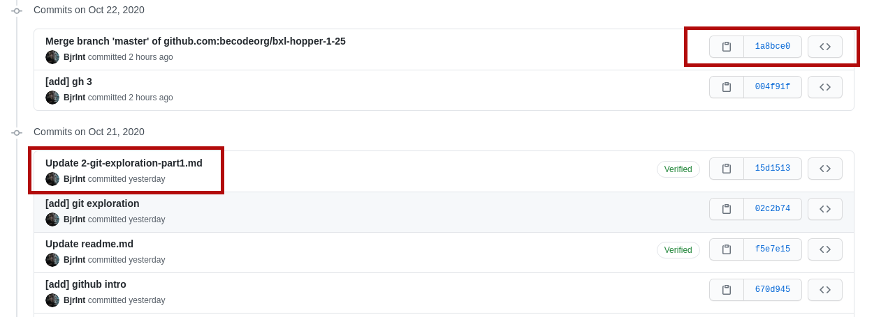
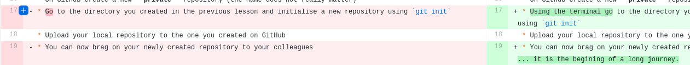
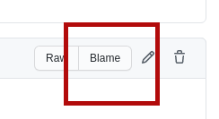

https://media.giphy.com/media/3ov9jU4ycPvfrPTsly/giphy.gif

# Git exploration (part 2)

You have some experience with git but you merely scratched the surface. 

Type of challenge: **consolidation/learning**  
Duration: **half a day**  
Team challenge: **solo**

## Learning objectives
At the end of this challenge you should have a bigger picture as of how and why you should use git.

## The mission
Check what you see on this GitHub page. Just explore what the site has to offer. What does this button do? What does it mean in terms of git?

Clone THIS repository. You know have your own copy of the repository.

Check the following commands in your local copy `git log`, `git blame` `git checkout 119fe875c5a6e8a2becb69f6be3e7e83cd241e4b`.

