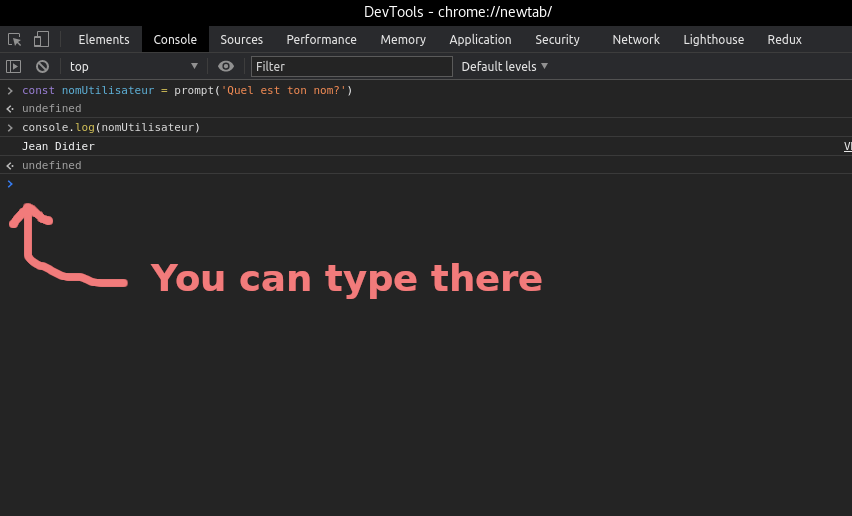

# Ressources


## Asking for user input

There are numerous methods for retrieving user input.

### Method1: Using the web dev tools in your browser

The easiest method is to use the javascript console inside your web browser. Simply open a new tab or window in your favorite browser (chrome/brave, firefox, opera, ...) and [open the development tools section](https://support.airtable.com/hc/en-us/articles/232313848-How-to-open-the-developer-console). This will give you a fully functional javascript playground. Use [prompt to open a dialog box](https://developer.mozilla.org/en-US/docs/Web/API/Window/prompt)



### Method2: Using node.js and the terminal

Using the terminal go to your working directory (ex: `js/`) and type the following command :
```
npm i readline-sync
```

This should install a node package on your computer. It will also create a `node_module` directory on your computer. **DO NOT COMMIT THIS FOLDER ON YOUR REPOSITORY** (to be sure this does not happen, use a [.gitignore file](https://www.pluralsight.com/guides/how-to-use-gitignore-file)).

Once the module is installed you can use it as follows.
- Import the module at the start of your file
```
const readlineSync = require('readline-sync')
```
- To ask for user input simply write:
```
let userName = readlineSync.question('May I have your name? ');
console.log('Hi ' + userName + '!');
```

Voilà! 

## Pay attention to the scope

Scope determines the visibility or accessibility of a variable or other resource in the area of your code. For example:

```javascript
let aGlobalVar = 'I can be accessed from anywhere in the code';

function circleArea(radius){
  let almostPI = 3.1415;

  return radius * radius * almostPi
}

console.log(aGlobalVar); // displays 'I can be accessed from anywhere in the code'
console.log(almostPI); // displays an error, the variable is declared in a function
```


Always declare your variables in the block they should be available in. 

Blocks are the set of instructions delimited by `{` and `}` (such as `if`/`else`, `while`, ´function`, ...)

```javascript
function aComplexFunction(){
  let availableInTheWholefunction = 'blablabla';

  if(/* condition */){
    let availableInTheIfBlock = 'blublublu';

    console.log(availableInTheWholefunction); // displays blablabla
    console.log(availableInTheIfBlock); // displays blublublu
  }

  console.log(availableInTheWholefunction); // displays blablabla
  console.log(availableInTheIfBlock); // displays an error, the variable is not declared in this scope
}
```