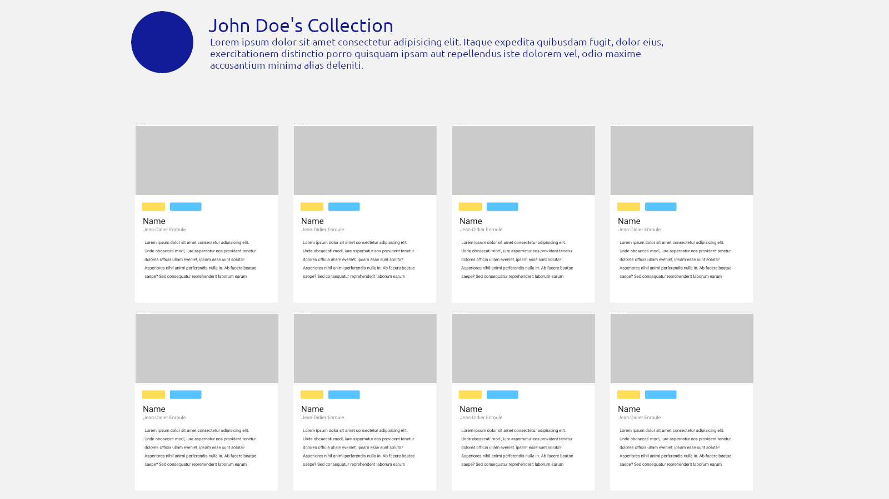

# Leaving the field

It is now time to leave the field, let's build a quick recap website with all that we have learned so far!

## Day one : The collection

Gather 10 pieces of art (book, videogames, movie, music, paintings), the only requirement is that they should all be of the same kind!

Each elements should have the following informations:
- A picture
- A description
- The name of its author
- A genre or category
- An external link to the piece (Youtube, Spotify, Steam, etc.)

## Day two : Building the website

Using the css framework of your choice build a first version of the website, based on the following mockups. On desktop use a 4-column based grid, on mobile only one column is shown. Use a `card` component for each of the elements, and a `tag` (bulma) or `badge` (bootstrap) component for the category/genre.




## Day Three : Adding some Javascript magic

We will use javascript to display our collection.

First we need to create a new javascript file `collection.js`, that will hold our entire collection in a single array. Each element of the array consists of an `object` containing all the relevant info.

```javascript
const collection = [
  {
    title: 'Arrested Development',
    author: 'Mitchell Hurwitz',
    category: ['comedy', 'mockumentary'],
    link: 'https://www.youtube.com/watch?v=1ZMNujDjGD4',
    description:  'The plot of Arrested Development revolves around the members of the Bluth family, a formerly wealthy family who continue to lead extravagant lifestyles despite their changed circumstances and who often find themselves drawn into interactions with incestuous undertones.'
  },

  // ...
]
```

### The Document Object Model

You can use javascript to modify any HTML page, in fact every HTML page can be seen as a sort of tree, called the **DOM** (short for **D**ocument **O**bject **M**odel).


Let's first learn [how to navigate through the DOM](https://developer.mozilla.org/en-US/docs/Learn/JavaScript/Client-side_web_APIs/Manipulating_documents).

### Generating the cards

Now that you have a basic understanding of what the DOM is, use `document.createElement` to iterate over your collection array and generate your webpage dynamically. Keep your HTML file as a reference and try to output the same visual result using Javascript.


## Day Four : 

Implement some filtering.