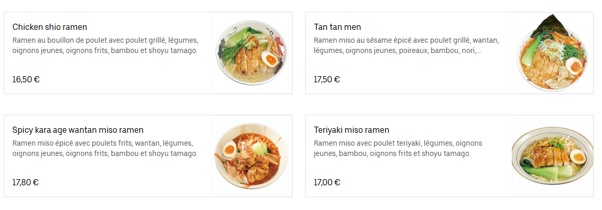
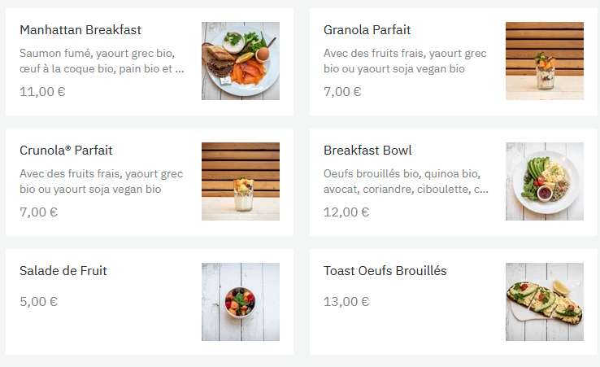
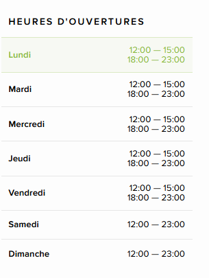

# 😷 Restaurant

Let's imagine a strange virus hits the planet Earth : shopkeepers and restaurants are forced to find solutions in order to continue serving the public. Your mission, if you accept it, is to digitize the processes of the different companies affected by this terrible pandemic.

- Type of challenge: **consolidation**  
- Duration: **3 days**  
- Team challenge: **team of 4**
- Deadline: **09/12/2020 19:00**
- [Submission form](https://forms.gle/UmTTfyF59kueUYhh7)

## Learning objectives

Using all that you know about frontend so far (DOM, events, date, intervals and regex) working on real use case.

## The mission

You will be in charge of building a restaurant's online delivery service. The site must have at least 2 pages.


### Presentation page

A page that displays the restaurant name and opening hours. The restaurant is open from Tuesday to Sunday, from 11h30 to 14h00 and 18h00 to 22h30 except on sunday evenings where it is closed. If the restaurant is closed at the moment you should display the information clearly. 

### Menu Page

On this page customers will be able to choose the dishes of their choice via a search bar. The menu must be composed of at least 10 dishes, each with a photo, a title, a price and a description. For example, if the menu includes the dishes: beef strogonoff and beef noodles and I enter beef in the search bar I should be able to find the 2 dishes mentioned and no others.

You can add dishes to a basket and display the price. When you validate your basket a confirmation of the delivery time pops up and updates every minutes. Delivery time is calculated like this:
```
if restaurant is open ?
time of basket validation + random 0-10 min + 30 min

else?
next restaurant opening + random 30-50 min
```

## Evalutation process 

- One repo per group
- Everyone from the group must contribute
- The website must look nice (use a css framework and custom css rules)
- Be creative!
- The website must use semantic HTML
- The website should be responsive (mobile & desktop)
- Every displayed feature must be functional, if you want to go the extra mile make a branch! 🤠

## Inspiration 

[A list of dishes](dishes.txt), you can use it if you want, or make your own menu.






