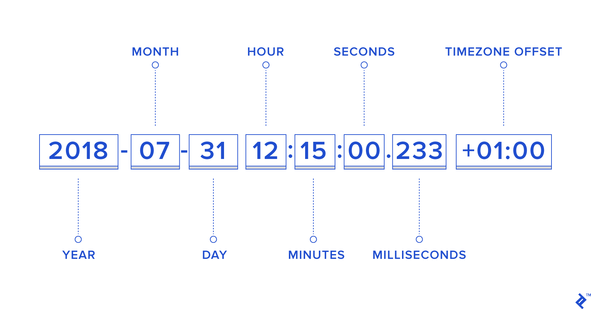

# The `Date` Object

Javascript has [a set of features to handle and manipulate time](https://developer.mozilla.org/en-US/docs/Web/JavaScript/Reference/Global_Objects/Date).

## Theory

### WARNING: TIMEZONES!

Timezones are a mess, they are a developer nightmare. It could be 6 in the morning for you while it's already 8 hours later in Tokyo, and its still yesterday's date in New York.

To try to solve this problem, developpers came with a concept called `timezone offset` : when using a date in javascript (and in many other programming languages), you'll often see a number at the end of the date. This is the number of hours ahead or behind the [Coordinated Universal Time
(UTC, in short)](https://en.wikipedia.org/wiki/Coordinated_Universal_Time).

For example in Brussels, we are one hour ahead of UTC, we would write:
```
2020-11-24T16:00+01:00
```

To say we are the 24th of November at 16h, Brussels time (UTC +1h)

### Creating a Date object

Handling and displaying dates in javascript always starts with a `new Date()` declaration, this object will allow you to initialize a reference to a certain point in time. If you do not pass arguments to the function it gives you today's date at the exact time you initialized the variable (up to a milisecond of precision)

```javascript
let now = new Date() // Today's date 
let dateInThePast = new Date('1990-12-25') // 25th December of 1990 (at midnight, since we do not set the time)
```

### Getting values

Once you created your date object. There are several ways to display informations from it.

##### Display the full date

There are a lot if different methods for just displaying the date as a text. You can check these out on MDN :

- [toDateString()](https://developer.mozilla.org/en-US/docs/Web/JavaScript/Reference/Global_Objects/Date/toDateString)
- [toISOString()](https://developer.mozilla.org/en-US/docs/Web/JavaScript/Reference/Global_Objects/Date/toISOString)
- [toLocaleDateString()](https://developer.mozilla.org/en-US/docs/Web/JavaScript/Reference/Global_Objects/Date/toLocaleDateString)
- [toLocaleString()](https://developer.mozilla.org/en-US/docs/Web/JavaScript/Reference/Global_Objects/Date/toLocaleString)
- [toLocaleTimeString()](https://developer.mozilla.org/en-US/docs/Web/JavaScript/Reference/Global_Objects/Date/toLocaleTimeString)
- [toString()](https://developer.mozilla.org/en-US/docs/Web/JavaScript/Reference/Global_Objects/Date/toString)
- [toTimeString()](https://developer.mozilla.org/en-US/docs/Web/JavaScript/Reference/Global_Objects/Date/toTimeString)
- [toUTCString()](https://developer.mozilla.org/en-US/docs/Web/JavaScript/Reference/Global_Objects/Date/toUTCString)

They all have their advantages and disadvantages, it could be really useful for debug, but they're not what we will focus on. 

A simple example before we move on:

```javascript
let dateInThePast = new Date('1990-12-25')

console.log(dateInThePast.toISOString()) // 1990-12-25T00:00:00.000Z
console.log(dateInThePast.toUTCString()) // Tue, 25 Dec 1990 00:00:00 GMT
console.log(dateInThePast.toString()) // Tue Dec 25 1990 01:00:00 GMT+0100 (Central European Standard Time)
```


There are is a method for extracting every information of the date Object. You want to retrieve the day ? Use [getDate()](https://developer.mozilla.org/en-US/docs/Web/JavaScript/Reference/Global_Objects/Date/getDate) ! You want the day of the week ? 0 being sunday, 6 being saturday use [getDay()](https://developer.mozilla.org/en-US/docs/Web/JavaScript/Reference/Global_Objects/Date/getDay).


*credits: toptal* 


An example is worth a thousand words :
```javascript
let dateInThePast = new Date('1990-12-25')

console.log(dateInThePast.getDate()) // 25
console.log(dateInThePast.getDay()) // 2 ( = tuesday)
console.log(dateInThePast.getFullYear()) // 1990
console.log(dateInThePast.getHours()) // 1 (midnight, UTC+1)
console.log(dateInThePast.getMilliseconds()) // 0
console.log(dateInThePast.getMinutes()) // 0
console.log(dateInThePast.getMonth()) // 11 (! Months start at 0 !)
console.log(dateInThePast.getSeconds()) // 0
```

If you want to display the dates in UTC time (minus the UTC offset), there is an equivalent for each of these methods, for example `getHours()` becomes [getUTCHours()](https://developer.mozilla.org/en-US/docs/Web/JavaScript/Reference/Global_Objects/Date/getUTCHours), et caetera...

### Timestamps

Among these functions there is a special one called [getTime()](https://developer.mozilla.org/en-US/docs/Web/JavaScript/Reference/Global_Objects/Date/getTime), this gives you a special value called `epoch`, it's the number of miliseconds since the 1st of January 1970.

This is a universal number that you can use across a number of languages and that is particularly useful for date conversion and manipulation.

```javascript
let christmas1995 = new Date('1995-12-25')
let halloween2002 = new Date('2002-10-30')

console.log((halloween2002.getTime() / 1000) + ' seconds have passed betweeen halloween 2002 and 1/1/1970')
console.log((halloween2002.getTime() - christmas1995.getTime()) / (1000 * 60) + ' minutes have passed betweeen halloween 2002 and c')
```

You can do wonderful things with timestamps...

```javascript
let halloween2002 = new Date('2002-10-30')
let threeDays = 1000 * 60 * 60 * 24 * 3 // 1000 miliseconds * 60 seconds * 60 minutes * 24 hours * 3 days

let threeDaysPastHalloween2002 = new Date(
  halloween2002.getTime() + threeDays
)

console.log(threeDaysPastHalloween2002.toString())
```

## More ressources :

- [Pierre Giraud (FR)](https://www.pierre-giraud.com/javascript-apprendre-coder-cours/objet-date/)
- ["Vanilla JS date manipulation"](https://g14n.info/2018/07/js-date-manipulation/)

## Exercises

### Exercise 1

Find the timezones of :
- Anchorage (USA)
- Reykjavik (Iceland)
- Saint-Petersburg (Russia)

And display the date and time of these cities along with the time and date of Brussels.

### Exercise 2

Using timestamps, find how many days have passed since the date of your birth. Feeling old, yet?

Write a function to find how many days have passed since any point in time (after 1970).

### Exercise 3

Using timestamps, find the exact time and date we will be in 80000 hours.

Write a function to display the time and date for any amount of hours given in the future. Create a [number input](https://developer.mozilla.org/fr/docs/Web/HTML/Element/Input/number) for the hours and listen for `keyup` events, dynamically display the date in the number of hours given by the input.

### Exercise 4

Using HTML, CSS (and javascript, of course) reproduce the following picture. This should be centered both horizontaly and vertically in your page.


The date should be of today, in your timezone. Refresh the display every seconds ([hint](../2.timeouts_and_interval)), so the time stays exact even when the page stays open for a long time

When clicking on the hours, toggle the display in 12-hours format or back to 24-hours format.