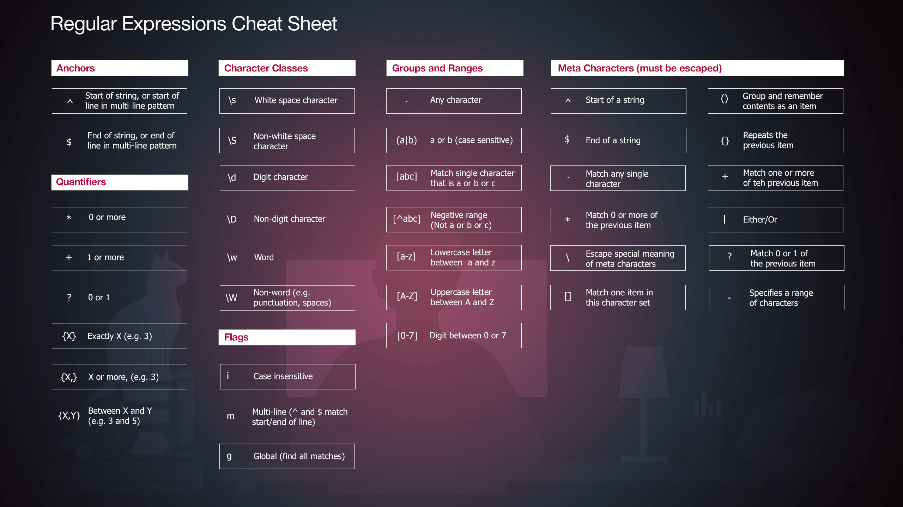

# Regular Expressions

- [1 - Basics](1.basics.md)
- [2 - Varying characters in pattern](2.chars.md)
- [3 - Character classes](3.charclasses.md)
- [4 - Capturing input](4.capture.md)

## More ressources:

- [A complete guide](https://javascript.info/regular-expressions)
- [Regular expressions tester](https://regex101.com/)

