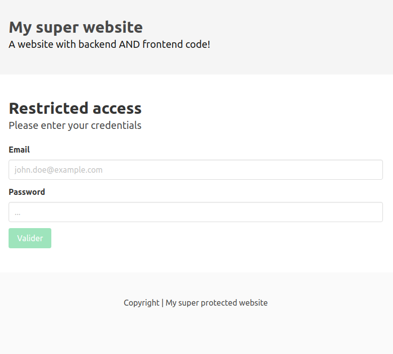
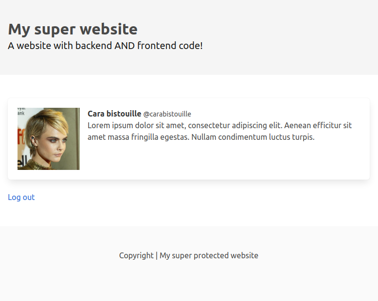
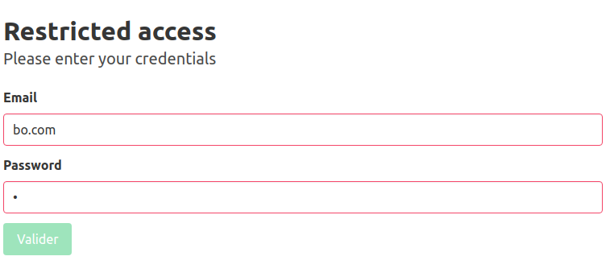
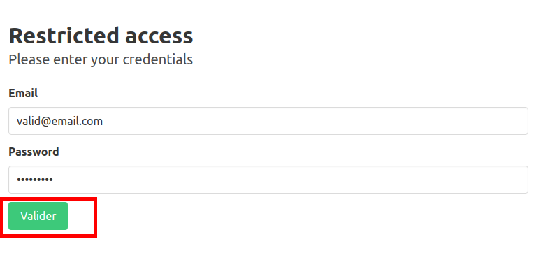
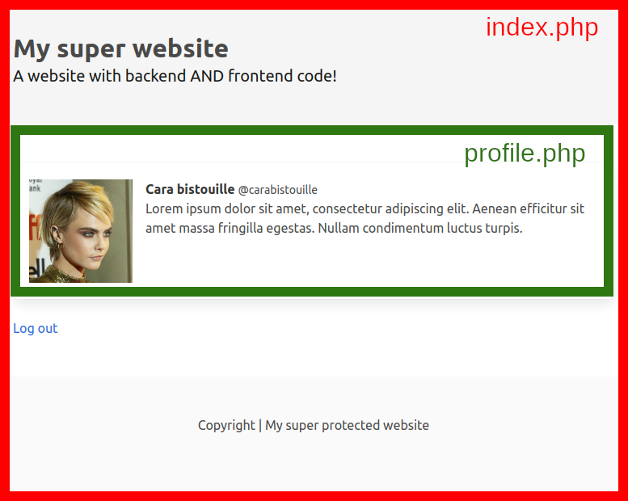
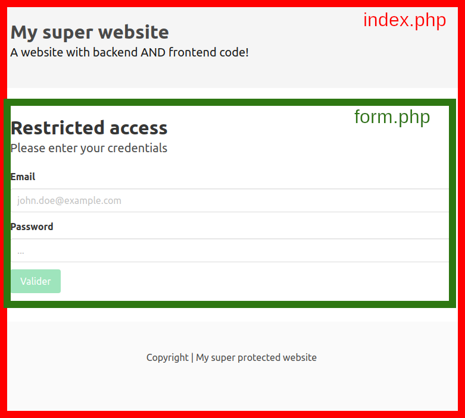

# Login page

Let's create our first full stack application! Our first authentication app. Allow a user to see a different content if he is logged in or not, using sessions (and keep track of the attempts using a log file)!

- Type of challenge: **consolidation**  
- Team challenge: **solo**

## Learning objectives

Understand the issues that the backend solves. Use PHP built-in functionalities to deliver a MVP (minimum viable product). Make use of the following concept:
- [Sessions](https://www.php.net/manual/en/session.examples.basic.php)
- [Conditions](https://www.php.net/manual/en/control-structures.elseif.php)
- [Includes](https://www.php.net/manual/en/function.include.php)
- [Creating and modifying files](https://www.php.net/manual/en/function.file-put-contents)

## The mission

Display an `index.php` page, the content of the page will vary depending if the user is logged in or not. 

- When you first load the page you see a `POST` form that allows you to enter your credentials. You CANNOT submit the form if the email address is invalid (not matching a standard email regex) or if the password **is less than 6 characters long** by disabling the form button. Create a `script.js` file for the form verification.
- When sending the form, the data is validated on the backend. If the password is `Ninja123` and the email `cara@bistouille.com`, create a session variable to authenticate the user and display the profile of the user. If not, just display `login failed`.
- Create a link to a `logout.php` page on the profile page to unset the session variable (log off the user).
- If you refresh the page the content should still vary wether the user is logged in or not (if logged in, it should display the profile, if not the form).
- At every login (each time the form is submitted), you should log the information in a `logs.txt` file. If the file does not exist, it should be created using PHP, if it exist add a new line to the file. You can use the function `file_put_contents()` with the APPEND_FILE option to do this in a single line of code. The log file should look like this:
```
[29 Dec 2020 11:55:58] <valid@email.com> ffdsfdsfd
[29 Dec 2020 11:57:25] <cara@bistouille.com> Ninja123
```

Use conditions and the `include()` function to modify the content of the page.


Here's the proposed file structure.
```
.
├── /includes
│   ├── form.php
│   └── profile.php
├── index.php
├── logout.php
├── (logs.txt) --> generated by PHP
└── script.js
```

### Bonus steps

Protect the included pages and the log file in a separate folder using the .htaccess method.

## Mockups



*The page if you are not logged in*




*The page if you loged in*




*invalid form*




*valid form, can be submitted*

### Include part of a page




