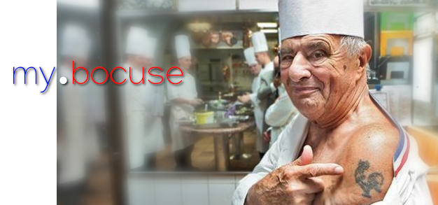

# MyBocuse

You have been selected to make a working prototype for the new cooking bootcamp of the Paul Bocuse Academy ("In Bocuse we trust"), a 7-months intensive cooking training with some of the best chefs around the world.

One part of the training consists of a daily activity called "The Recette", each day at 1:30PM a learner choses one of his favorite recipe and shares it with the rest of the class. 

- Type of challenge: **consolidation**  
- Duration: **4 days**  
- Team challenge: **team of 4**
- Deadline: **14/01/2021 19:00**
- [Submission form](https://forms.gle/UmTTfyF59kueUYhh7)

## Learning objectives
- Create a fullstack application
- Learn how to CRUD (create, read, update and delete) data in a mysql database

## The Mission

Your job is to design their platform, "MyBocuse" so that :
- People related to the Bocuse Academy are listed in a database. Relevant informations to save are: `first name`, `last name`, `email` (for logging in), password, account_type (chef or learner). You can add more fields if you want (twitter account, profile picture, ... it's up to you!)
- Learners can pick a daily slot for "The Recette", you must ensure that for any given date there is one (no less, no more) talk by a learner. For each of them you must at least store the topic of the recipe, the date it will be (or was) presented, and the learner who presented it (`foreign key` wink wink).
- Learners must be present every week day. To verify that this was indeed the case you should design a mechanism so that when a learner presses a button it stores the arrival & when they press the button back at the end of the day it store the departure time. Make a table to store all learners arrival and departure time. Chefs do not need to check in/out of class, they are Chefs after all...
- People that are not logged in cannot see any information
- Learners can see all previous and future "The recette" listed on a page, and their own attendance informations. 
- Chefs can see past and future "The Recette" and everyones attendances information. 
- **BONUS:** Learners can edit their own profile and delete their own Recette
- **BONUS:** Chefs can edit everyone's profile (including their own), and everyone's Recette.
- **BONUS:** Create a promo system so that learners and chef can be splitted into different subgroups.

## Important notice
- Add some javascript to better handle forms, but remember that frontend validation is not secure. People can disable javascript from their browser, or use their browser console to circumvent your script. Always check informations on the server side.
- You should host the website so that there is an online example available for your coach to validate your work.
- You should also upload your source on Github, ONE group = ONE repository.
- DO NOT INCLUDE YOUR MYSQL CREDENTIALS ON GITHUB, NEVER (use a separate file for storing mysql usernames and password and .gitignore it!)
- All the passwords in your database should be `hashed` (one way encryption, [more info here](https://www.php.net/manual/en/function.password-hash.php)). DO NOT STORE STORE THE PASSWORDS AS CLEAR TEXT!
- Several people can have the same first name or last name (it happens), however email addresses should always be unique. The mysql `UNIQUE constraint` might be useful here.
- Make sure to plan what you are going to do! Draw database schematics, website wireframes and keep track of development progress (Trello or GitHub projects). Do not directly jump right into the coding part.
- The checkin/out feature is not the easiest, keep it for the end. Focus on the essentials first!