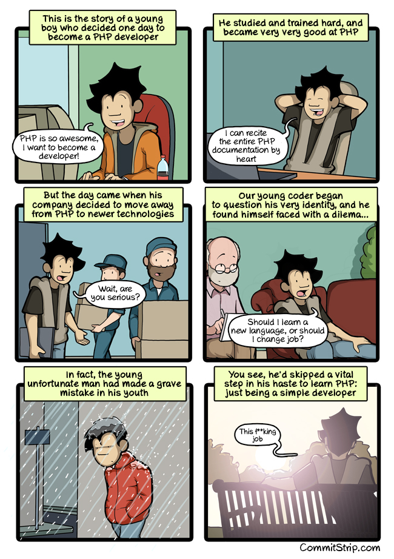

# PHP Fundamentals

1. [Introduction](1-php-introduction.md)
2. [Variables](2-php-variables.md)
3. [Conditional structures](3-php-conditions.md)
4. [Drill](4-php-drill.md)
5. [Arrays](5-php-array.md)
6. [Loops](6-php-boucles.md)
7. [Functions](7-php-fonctions.md)
8. [Form](8-php-formulaires.md)

