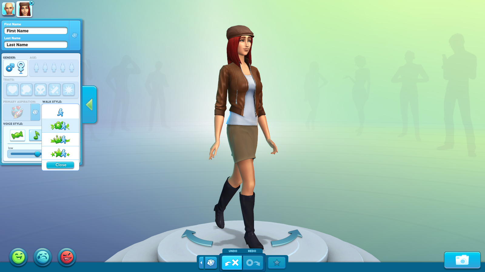
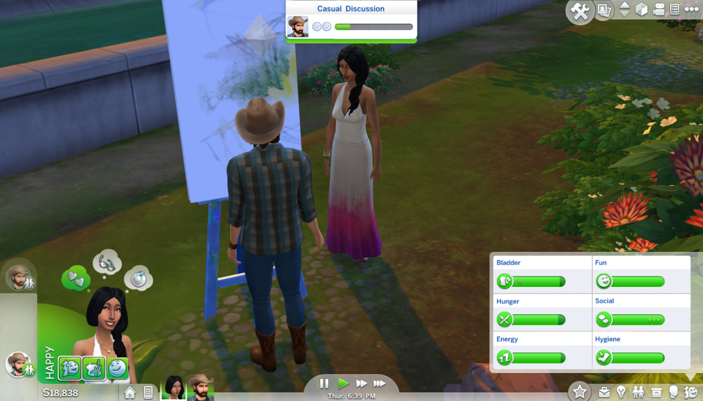

# Introduction (The Sims)

> The Sims is a series of life simulation video games developed by Maxis and published by Electronic Arts. The franchise has sold nearly 200 million copies worldwide, and it is one of the best-selling video game series of all time. It is a simulation of the daily activities of one or more virtual people ("Sims") in a suburban household near a fictional city. Players control customizable Sims as they pursue career and relationship goals.

You're working on a new episode of The Sims game and you'll have to write down requirements for the game. You will need to focus on one particular, yet crucial, aspect of the game: the characters.

Just grab something to write on, the goal of this exercise is to list all the feature we'll need in our class.

## What defines a character?

Ask yourself what is the set of features you'll want to set up as a developper. Let's break this down into two categories:
- Things that you set up at the begining of the game, when you're creating a new character.
- Things that could happen with your character during the game.

### Character creation

From the picture above there are some obvious variables we can assign to a character. It's identity, but also its physical traits. 

What are the information you could store? Try to list them up.

### State variation

Now that our character has been created, we need a way to store its vital needs and its behavioural changes. 

We also need to perform some actions to change those variables (ex: `eat` to restore `hunger`)

Try to sort both into two categories:
- variables (ex: `energy`)
- functions (ex: `sleep()`)