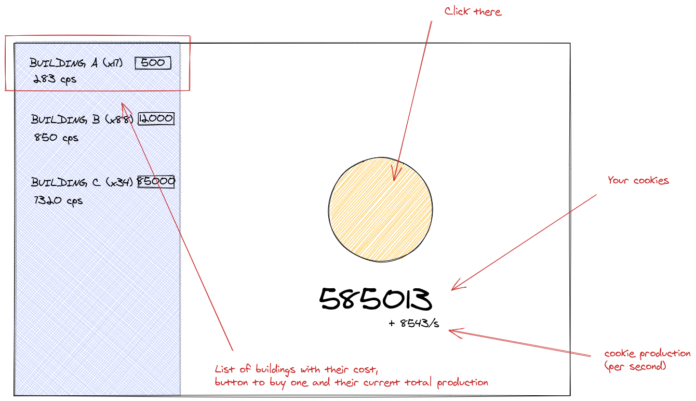

# React Cookie Clicker

- Type of challenge: **learning**
- Duration: **3 days**
- **Solo** challenge
- Deadline: **26/02/2021 17h00**
- [Submission form](https://forms.gle/UmTTfyF59kueUYhh7)

> Cookie Clicker is an incremental game created by French programmer Julien "Orteil" Thiennot in 2013. The user initially clicks on a big cookie on the screen, earning a single cookie per click. They can then spend their earned cookies upon purchasing assets such as "cursors" and other "buildings" that automatically produce cookies. Upgrades are also available and can improve the efficiency of clicks and buildings, among many other mechanics that allow the user to earn cookies in different ways. 

## Learning objectives

- Get to know the react.js environment
- Understand the basic principles of state management

## The mission

This challenge will have you create a cookie clicker using React. Follow the instructions to complete the challenge, to get some ideas check the examples in the resources section.

- You start the game with a "cookie" to click on. Clicking on it will increase your score by one
- Once you reach a certain amount of cookie (eg.: 10). You can buy your first building. Buildings allow you to generate cookie automatically
- The more you buy a certain type of building, the more it becomes expensive.
- You gradually unlock new building as your cookie production grows.
- Want to go further ? 
    - Find a way to save/export a running game
    - Achievements? 
    - Anything you could think of!

## How to start ? 

First think of which values you are going to store and dsiplay. How are you going to handle clicks (events) ? How are you going to handle increments over time ?

## Resources

[**The original cookie clicker**](https://orteil.dashnet.org/cookieclicker/)

### React tutorial

- (FR) [⚛️ REACT : 1H POUR COMPRENDRE LA LIBRAIRIE !](https://www.youtube.com/watch?v=no82oluCZag)
- (FR) [Tutoriel React Complet (36 parties)](https://www.youtube.com/watch?v=SMgQlTSoXf0&list=PLjwdMgw5TTLWom67YfZuha-1iYzIirwJR)
- [Interactive React tutorial](https://react-tutorial.app/app.html)
- [React.js website](https://reactjs.org/)

### Useful tools

- [Enable JSX syntax for Emmet](https://medium.com/@eshwaren/enable-emmet-support-for-jsx-in-visual-studio-code-react-f1f5dfe8809c)
- [React Refactor (VsCode extension)](https://marketplace.visualstudio.com/items?itemName=planbcoding.vscode-react-refactor)
- [JSX snippets (VsCode extension)](https://marketplace.visualstudio.com/items?itemName=skyran.js-jsx-snippets)
- React dev tools (Browser extension)
    - [Firefox](https://addons.mozilla.org/en-GB/firefox/addon/react-devtools/)
    - [Chrome](https://chrome.google.com/webstore/detail/react-developer-tools/fmkadmapgofadopljbjfkapdkoienihi?hl=en)

